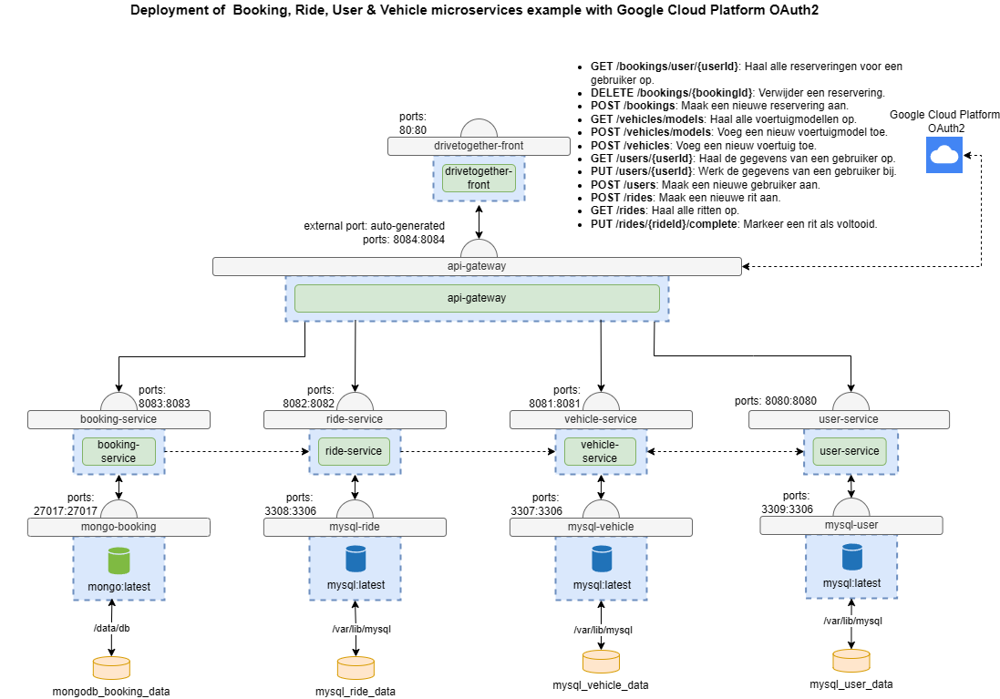

# DriveTogether

## Project Overview

Wij, Robbe de Busser en Yoshi Cooremans hebben het volgende gekozen als thema voor het project.

Het thema van het project is een applicatie / ontwerp voor een carpooling app. Wij hebben de volgende gegevens gemaakt.

## Micro-Services

### User-Service:

-   Opslaan van gebruikers informatie zoals:
    -   Naam
    -   Email
    -   Telefoonnummer
    -   Address
-   Voor alle endpoints in postman kun je naar [ReadMe/user-service](./user-service/readme.md) gaan.

---

### Vehicle-Service:

-   Opslaan van informatie voertuig zoals:
    -   Eigenaar (User-service)
    -   Nummerplaat
    -   Bouwjaar
    -   Model
        -   Model naam
    -   Capaciteit
-   Ieder voertuig heeft 1 model, maar een model kan meerdere voertuigen hebben.
-   Voor alle endpoints in postman kun je naar [ReadMe/vehicle-service](./vehicle-service/readme.md) gaan.

---

### Ride Service

-   Opslaan van rit informatie
    -   Auto (vehicle-service)
    -   Vertrekplaats
    -   Aankomst plaats
    -   Start datum en tijd
    -   Eind datum en tijd
    -   Beschikbare plaatsen
    -   Is afgerond?
-   Voor alle endpoints in postman kun je naar [ReadMe/ride-service](./ride-service/readme.md) gaan.

---

### Booking Service

-   Opslaan van booking informatie
    -   Plaatsen geboekt
    -   Tijd van boeken
    -   Rit (ride-service)
-   Voor alle endpoints in postman kun je naar [ReadMe/booking-service](./booking-service/readme.md) gaan.

## Deployment Schema

Dit is het deployment schema dat wij hebben.

## Extras

### Front-end

Voor de front-end hebben we gekozen om dit in React te doen. Dit omdat react de mogelijkheid geeft om snel en makkelijk een front-end op te bouwen. De React app wordt automatisch in een docker image gezet en wordt ook gebruikt in de docker compose.

Voor meer informatie over de front-end kijk naar de [ReadMe/drivetogether-front](./drivetogether-front/README.md)

---

### KuberNetes

De docker-compose is omgezet naar Kubernetes, wij hebben doordat Okteto Cloud vanaf 15 januari geen free tier meer aanbied. Niet kunnen testen om de kubernetes cluster op de cloud te hosten. Wel hebben wij via MiniKube een lokale kluster kunnen maken en deze kunnen runnen.

---

### Logisch gebruik van CluserIP en Nodeport

Binnenin de kubernetes yml hebben wij logisch gebruik gemaakt van ClusterIP en nodeport. Dit wil zeggen dat iedere service die met elkaar moet verbinden gebruikt maakt van ClusterIP en de Gateway en de Front-end gebruik maken van NodePort. Dit wil zeggen dat deze 2 via het IP van Minikube op de poort van de Nodeport toegangkelijk zijn.

### Monitoring met Prometheus

Wij hebben Prometheus opgezet om de monitoring binnin onze pods te bekijken.
Zie hier een screenshot van de Prometheus.

