# Alle endpoints voor de api-gateway

## Endpoint booking

## Get

### Endpoint voor het ophalen van de bookings aan de hand van userId

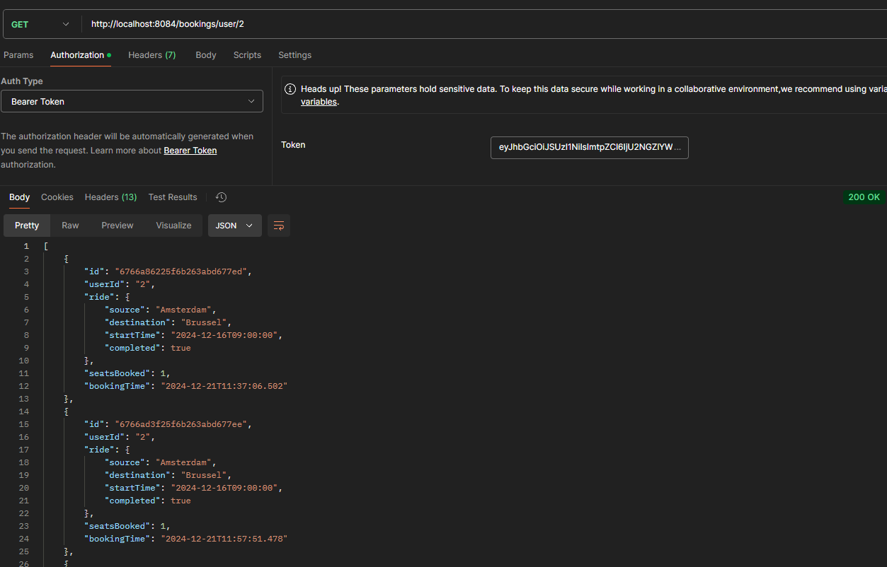

## Delete

### Endpoint voor het deleten van een booking

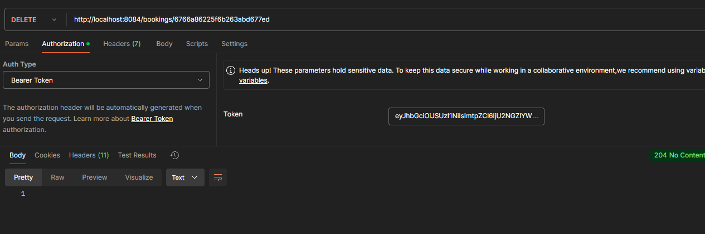

## Post

### Endpoint voor het maken van een booking

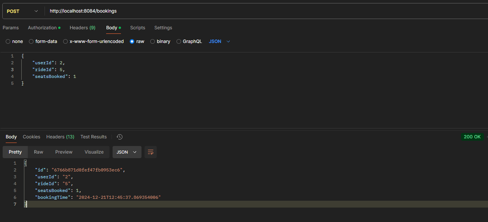

## Endpoints vehicle

## Get

### Endpoint voor het ophalen van vehicle models

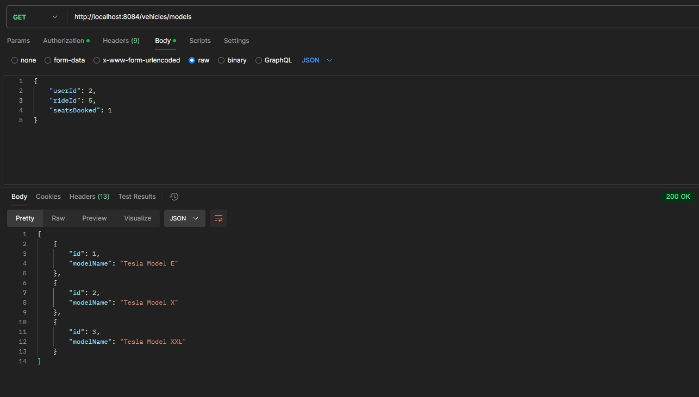

## Post

### Endpoint voor het maken van een vehicle model

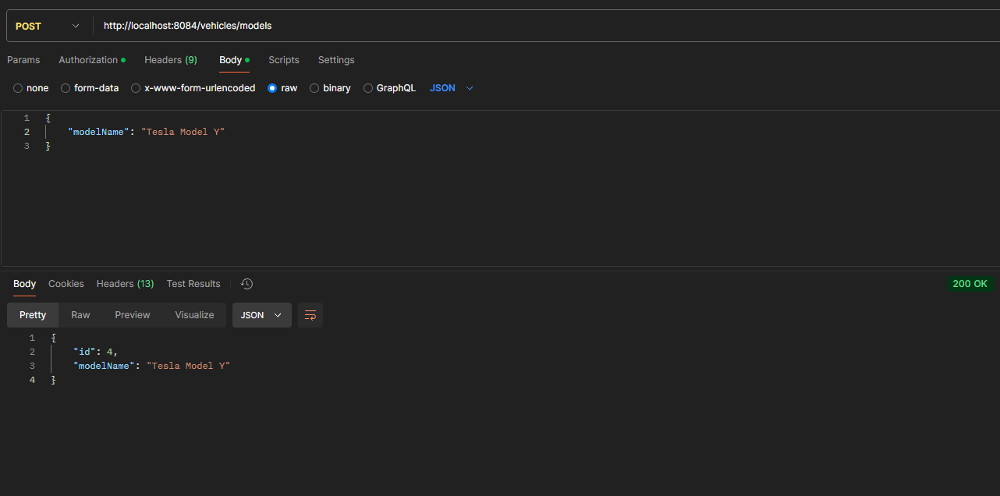

## Post

### Endpoint voor het toevoegen van een vehicle met bijhorende user

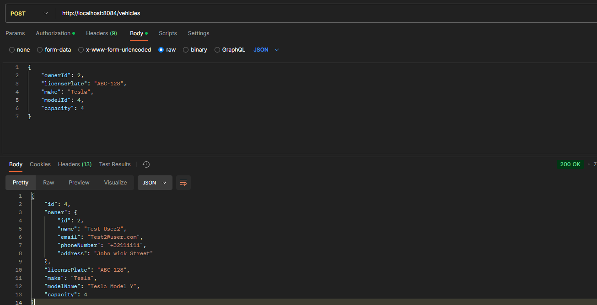

## Endpoints user

## Get

### Endpoint voor het ophalen van user aan de hand van userId

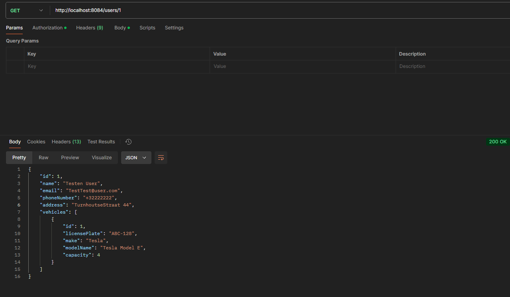

## Put

### Endpoint voor het updaten van een user

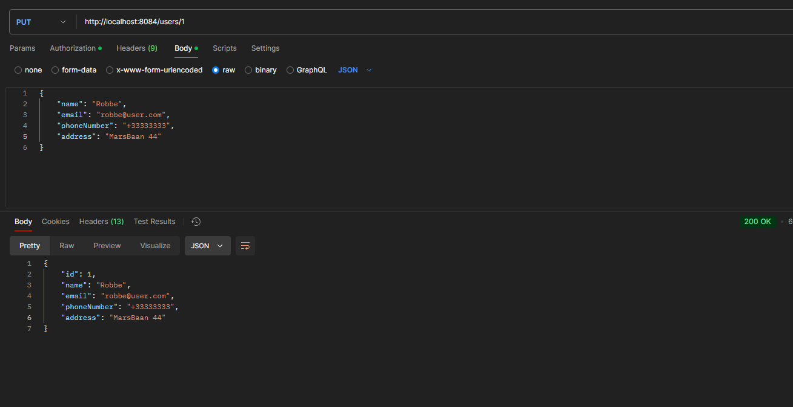

## Post

### Endpoint voor het maken van een nieuwe user

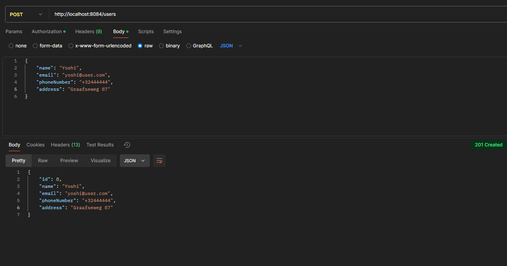

## Endpoints ride

## Post

### Endpoint voor het maken van een nieuwe ride met bijhorende user en vehicle

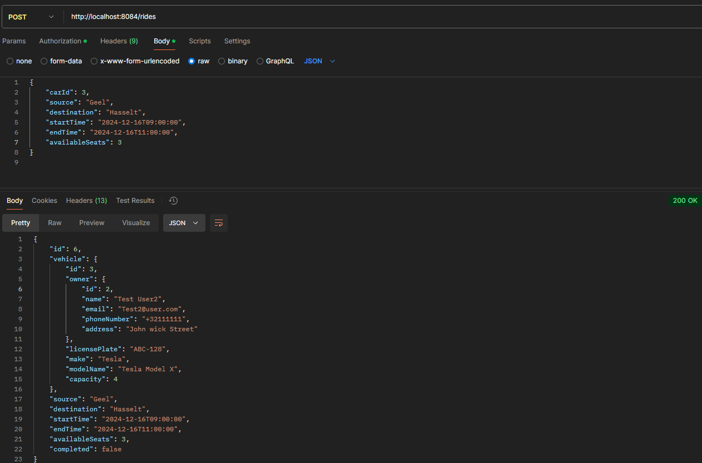

## Get

### Endpoint voor het ophalen van alle ride

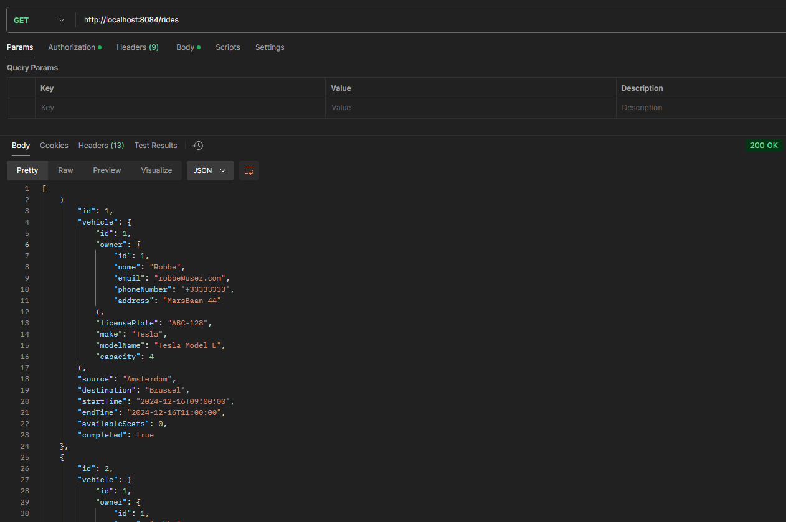

## Put

### Endpoint voor het voltooien van een ride

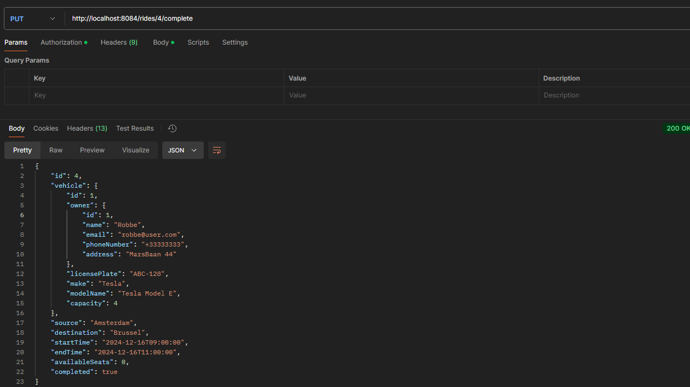
