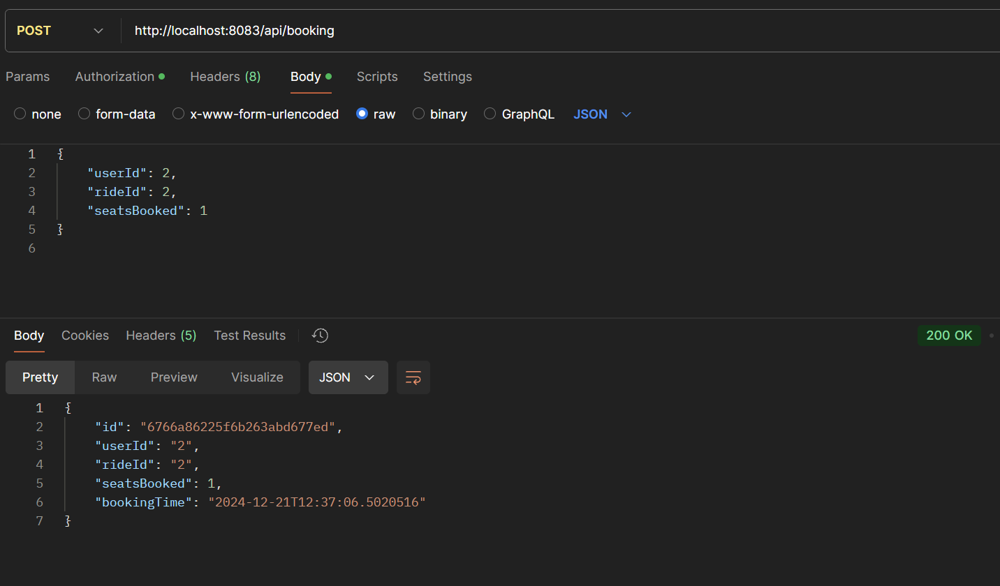
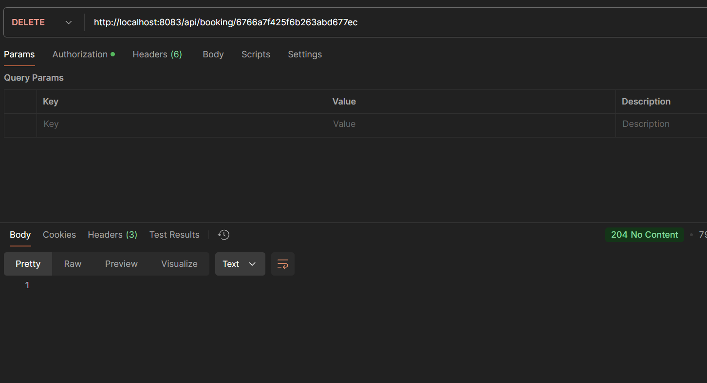
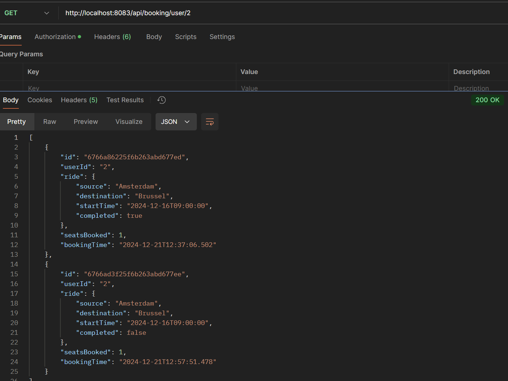

# Alle endpoint voor de booking-service

## Post

### Endpoint voor het toevoegen van een booking aan de hand van een userid en rideid

## Delete

### Endpoint voor het verwijderen van een bestaande booking

## Get

### Endpoint voor het ophalen van een booking aan de hand van een userId

