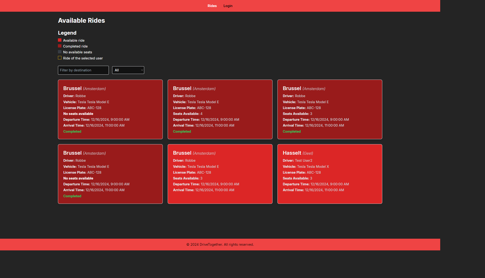
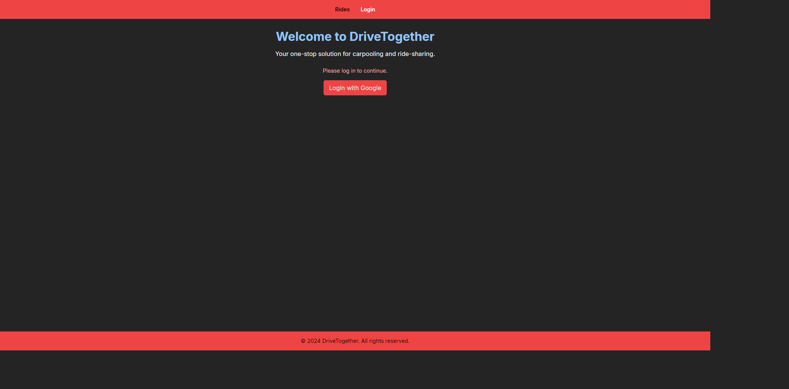
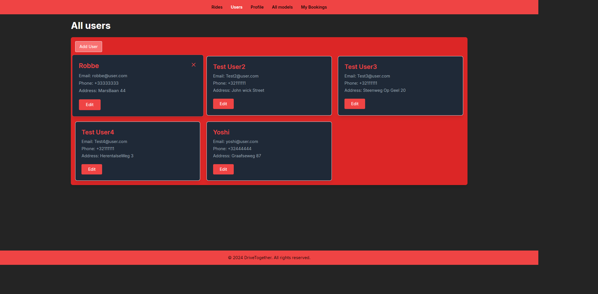
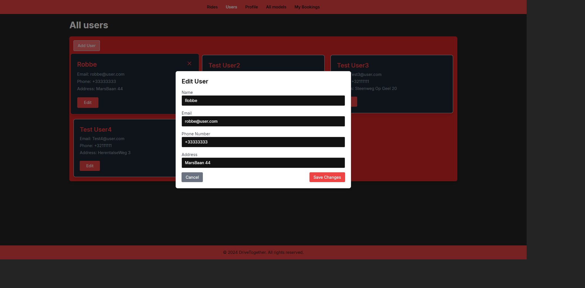
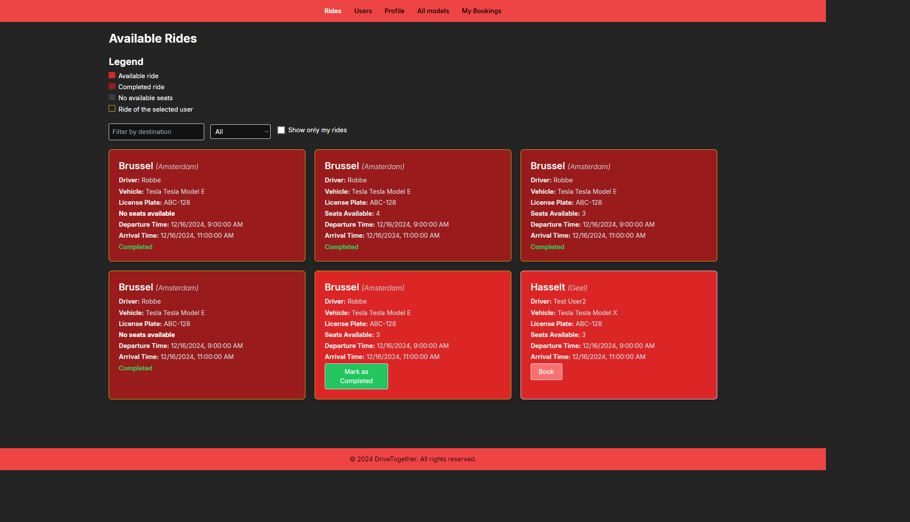
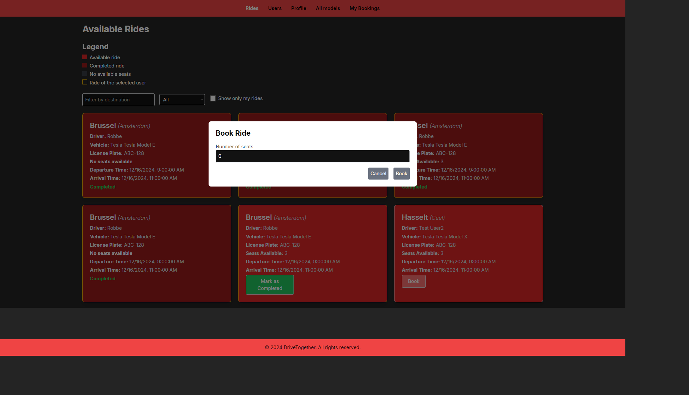
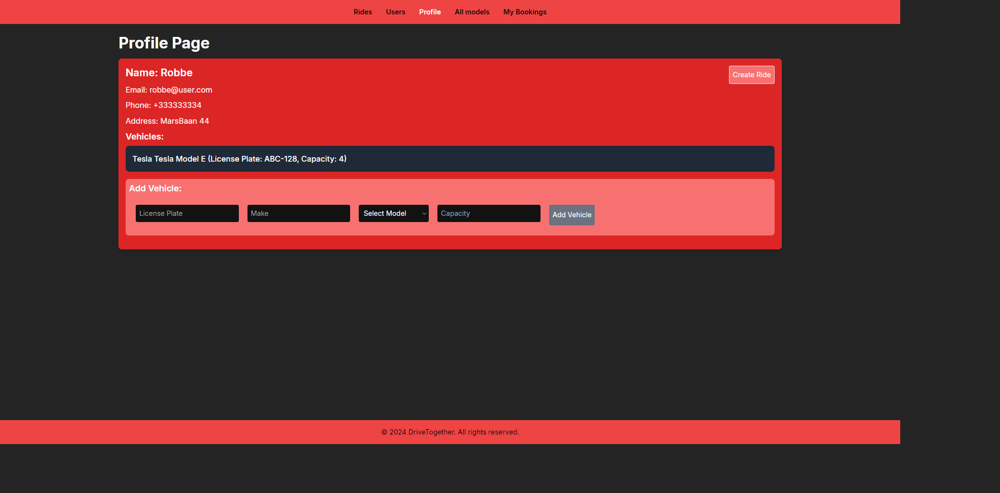
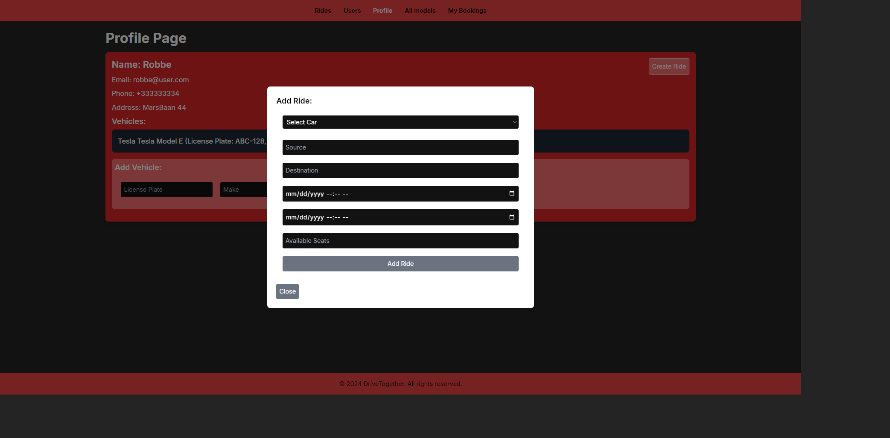
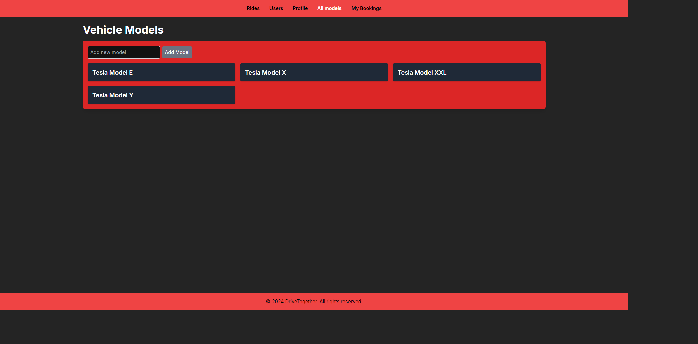
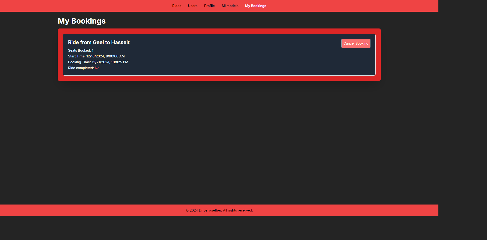

# Screenshots van de frontend pagina's

## Eerste pagina

### Hier staan alle rides en een knop om in te loggen.

## Inlog pagina

### Als we dan op inlog klikken komen we op de inlog pagina waar je kan inloggen met google.

## User pagina

### Als we dan zijn ingelogd kan je bij users een user selecteren. Ook kan je hier de user bewerken.

### Hier kan je dan alle gegevens van de user bewerken.

## Rides pagina

### Als we dan terug naar de rides gaan zien we 3 dingen. Alle vakjes die een gele rand hebben zijn mijn eigen rides die ik heb aangemaakt. Dan kan je ook een eigen ride completen en een andere ride die van een andere user boeken. Deze pagina hangt ook af van de geselecteerde user op de user pagina.

### Hier kan je dan een ride booken voor x aantal personen.

## Profile pagina

### Als we dan op profile klikken komen we op de profile pagina waar we ons profiel kunnen zien, rides kunnen aanmaken en onze eigen vehicles kunnen aanmaken/bekijken. Deze pagina hangt ook af van de geselecteerde user op de user pagina.

### Hier kan je dan een ride aanmaken

## Models pagina

### Als we dan op All models klikken kan je alle models zien die er zijn gemaakt van alle users. Hier kan je ook een model toevoegen.

## Bookings pagina

### Als we dan op My Bookings klikken kan je al je bookings zien die je hebt gemaakt. Ook kan je hier je booking annuleren. Deze pagina hangt ook af van de geselecteerde user op de user pagina.

