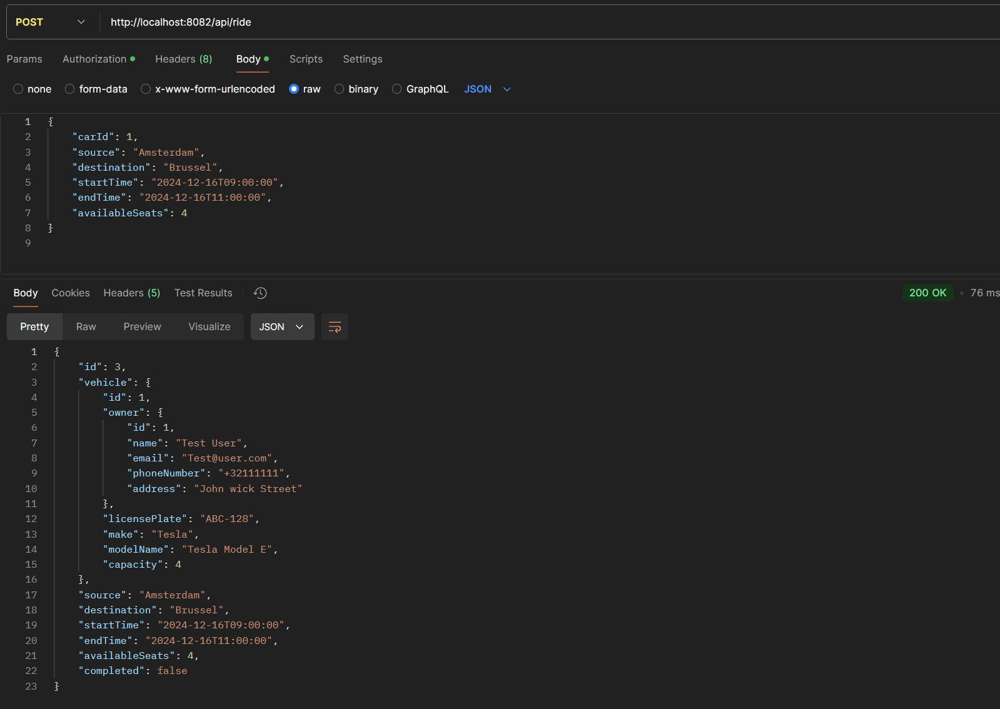
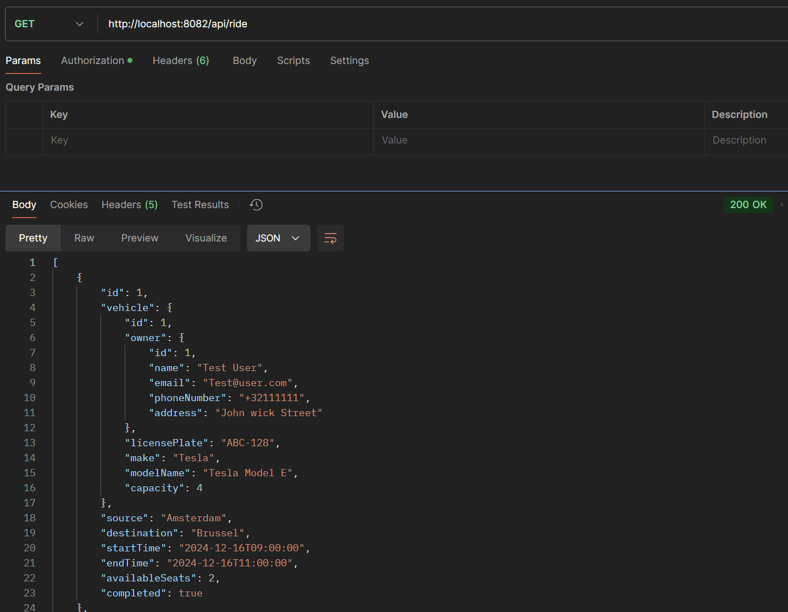
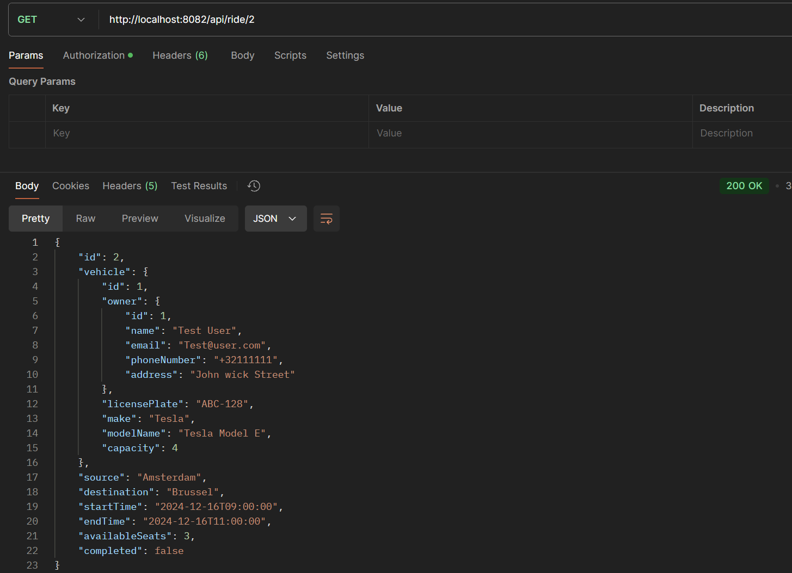
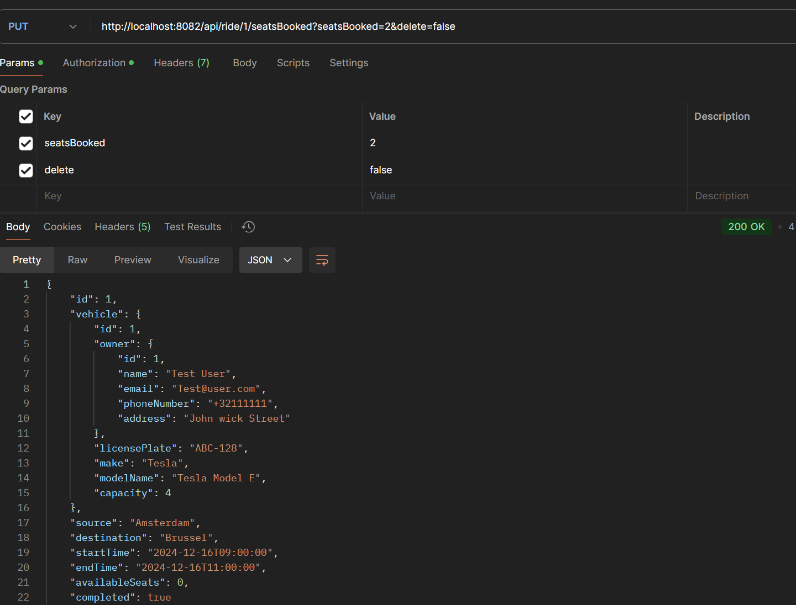
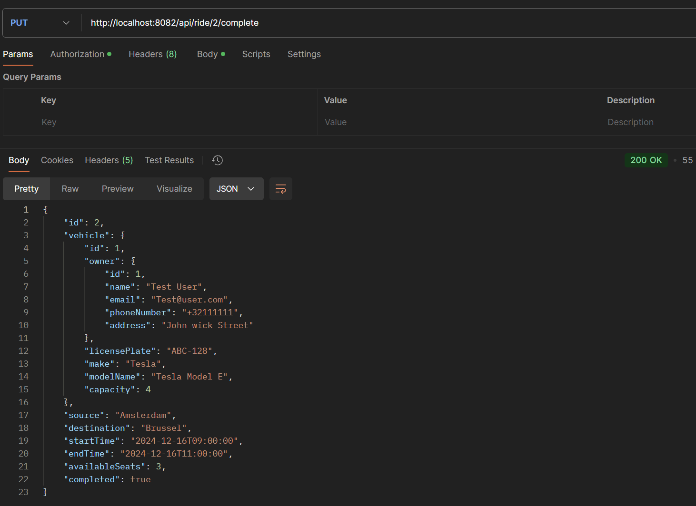

# Alle endpoint voor de ride-service

## Post

### Endpoint voor het toevoegen van een ride met bijhorende user en bijhorende vehicle

## Get

### Endpoint voor het ophalen van alle rides

## Get

### Endpoint voor het ophalen van een ride aan de hand van rideId

## Put

### Endpoint voor het updaten van de seats voor een ride

## Put

### Endpoint voor het voltooien van een ride

