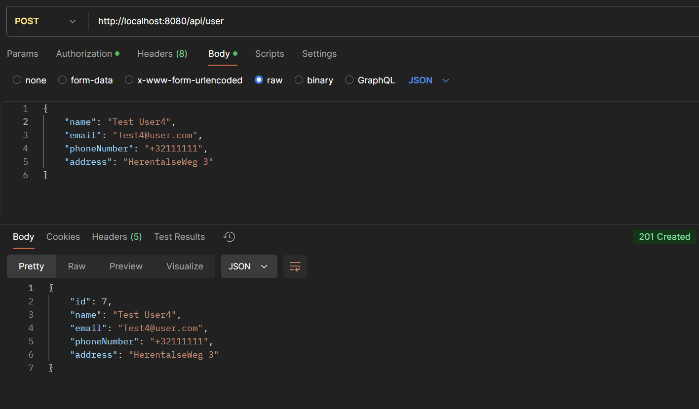
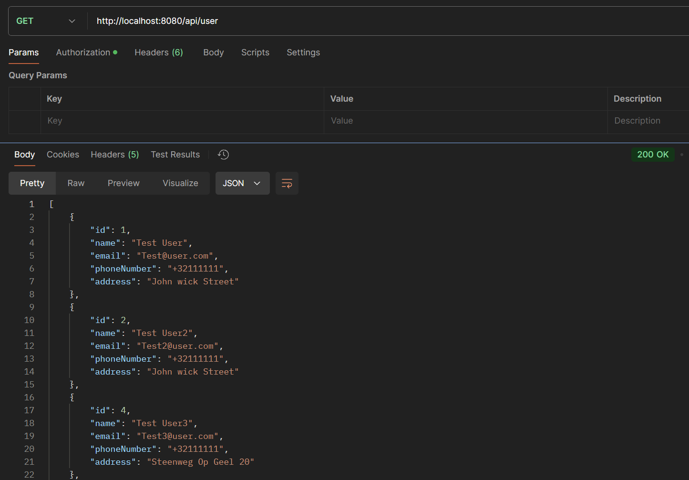
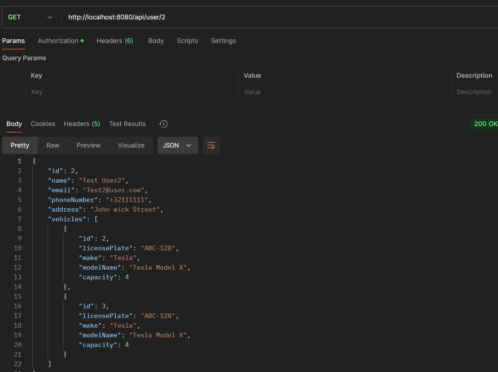
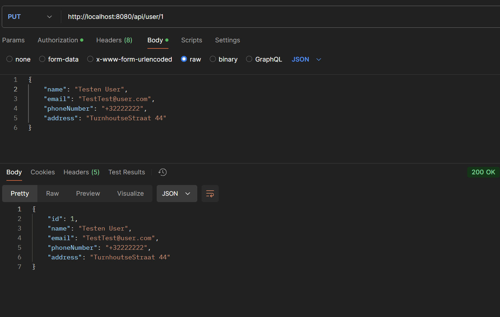

# Alle endpoints voor user-service

## Post

### Endpoint voor het toevoegen van een user

## Get all users

### Endpoint voor het ophalen van alle users

## Get user by id

### Endpoint voor het ophalen van een user aan de hand van een id

## Put user

### Endpoint voor het updaten van een user aan de hand van body

