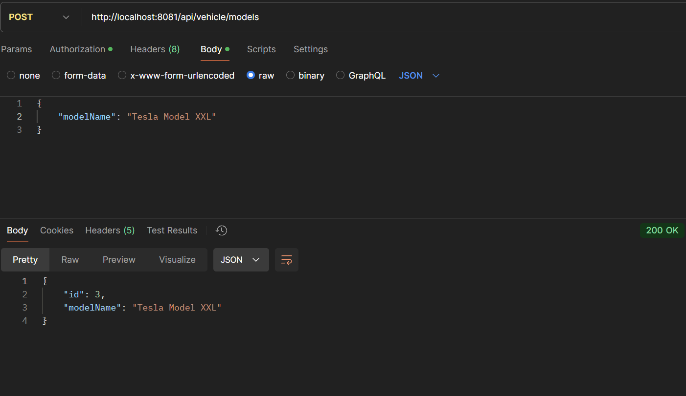
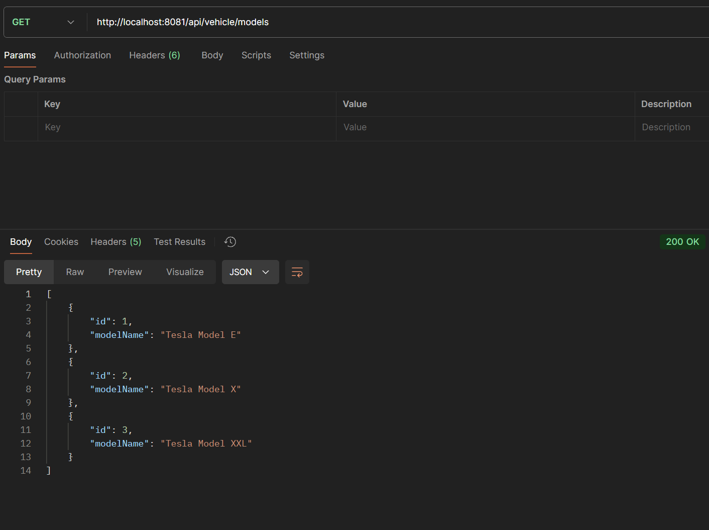
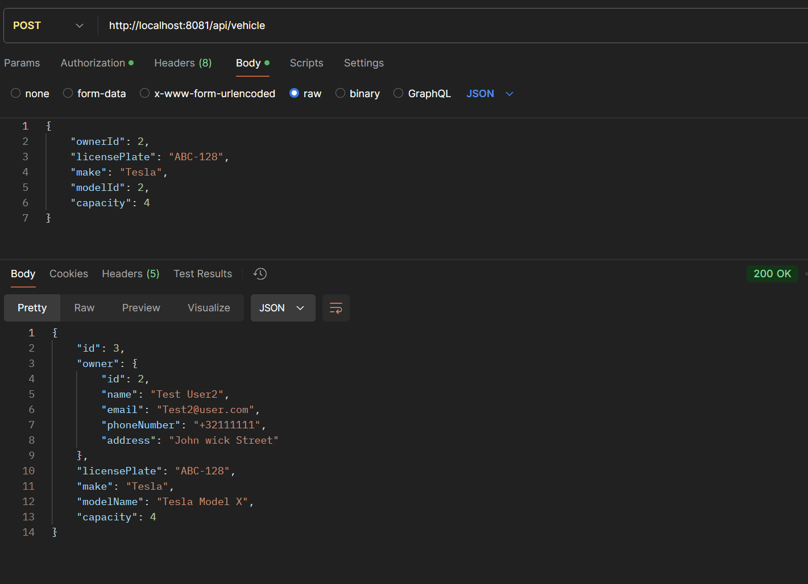
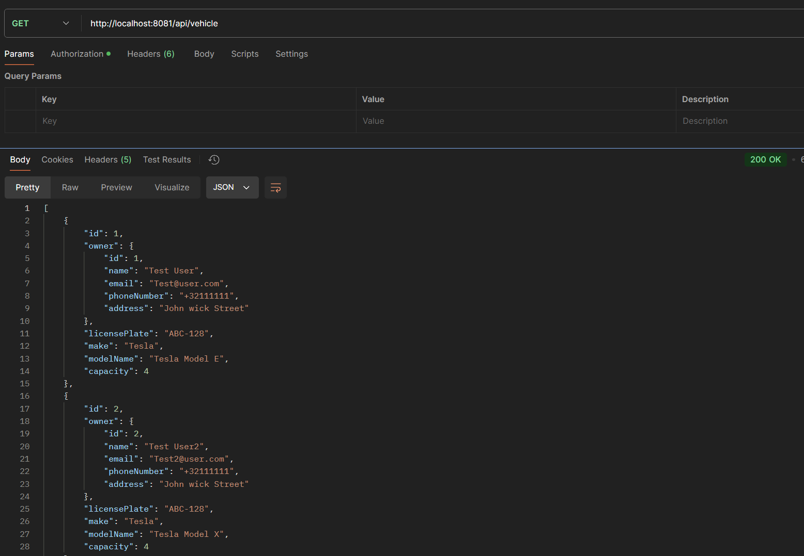
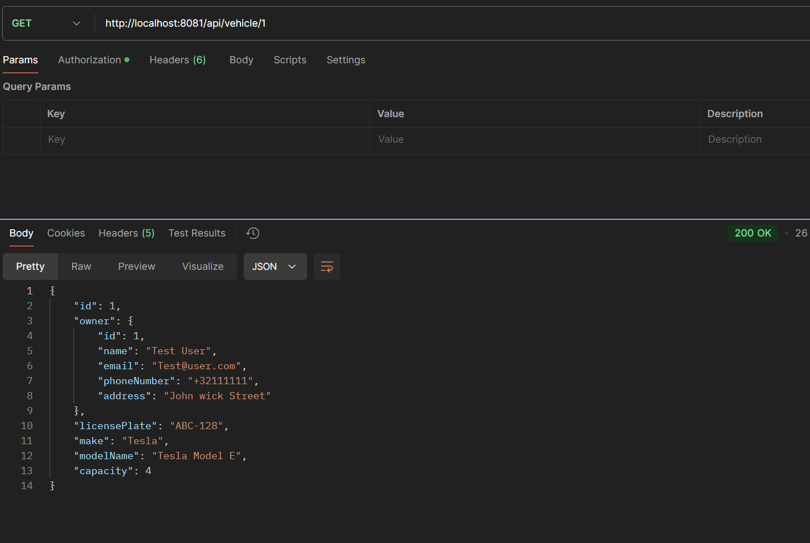
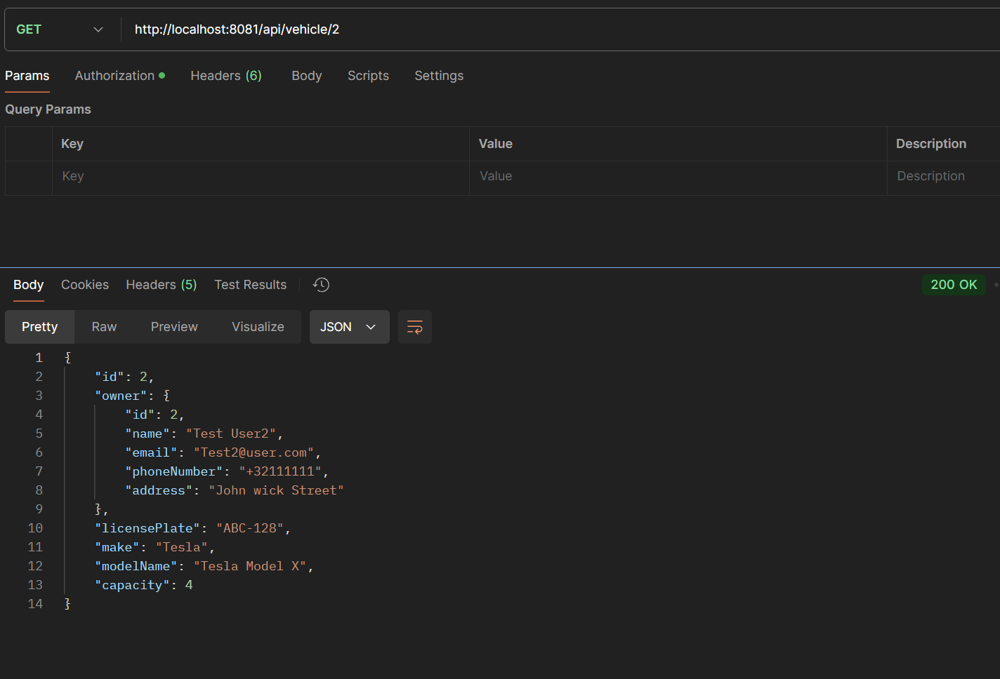

# Alle endpoint voor de vehicle-service

## Post

### Endpoint voor het toevoegen van een vehicle model

## Get

### Endpoint voor het ophalen van de vehicle models

## Post

### Endpoint voor het toevoegen van een vehicle met bijhorende user

## Get

### Endpoint voor het ophalen van de vehicles met bijhorende user

## Get

### Endpoint voor het ophalen van de vehicles met bijhorende user aan de hand van vehicle id

## Get

### Endpoint voor het ophalen van de vehicles met bijhorende user aan de hand van user id

